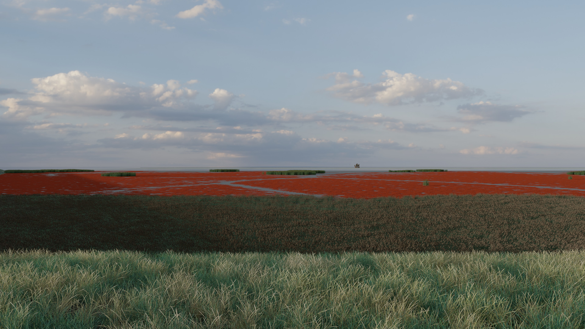

 

# Using photorealistic 3D visualization to convey ecosystem restoration to the public

This repo contains example code accompanying the paper [Using photorealistic 3D visualization to convey ecosystem restoration to the public](https://doi.org/10.3389/fclim.2025.1525331).

## Structure

The file `viz_prep.ipynb` takes in modelled data (included `*.npz` files) to set up the landscape. It then prescribes paths to source files for 3D objects used in the visualisation, as well as their placement and orientation within the landscape. It also generates a series of "maps", defining various sections of the landscape, which are stored in the folder `FlatMaps`.

Under `Blender_files` you will find:
- `RealignSystem.blend`, which is ready to run. Simply load it in Blender, navigate to the script `main.py`, and click "Run".
- Separate copies of all the Python scripts contained in`RealignSystem.blend`, for convenient reference.

**Note** that the 3D objects themselves are not included, as they are very heavy. For example objects you can use with this repo, please contact [Prof. Johan van de Koppel](mailto:johan.van.de.koppel@nioz.nl).

## Working in Blender

The material included under `Blender_files` was tested with Blender 3.6.5 and is expected to work with Blender 3.6 LTS. Adaptation may be required to work in Blender 4.x and up.

In producing our visualisations we used, among others, freely available 3D assets from https://polyhaven.com/ and custom assets by [Ulco Glimmerveen](https://gallery.ulco-art.nl/).

